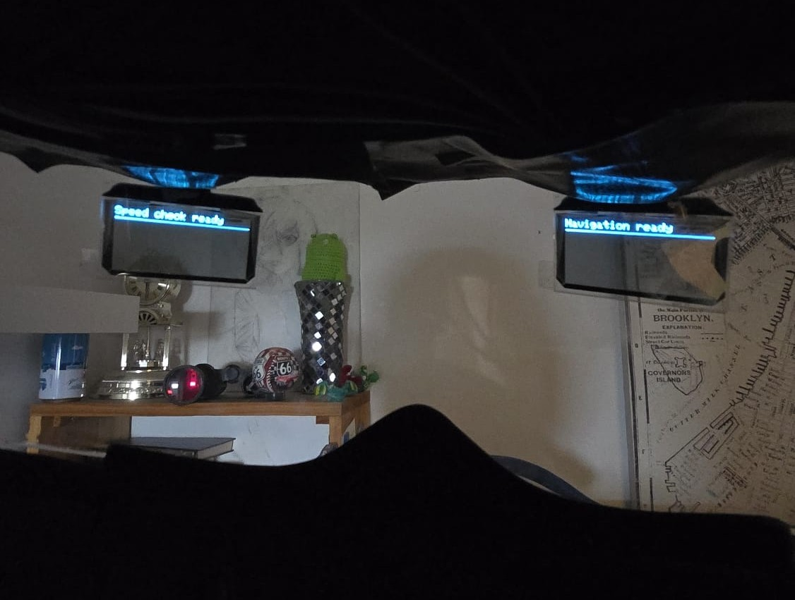
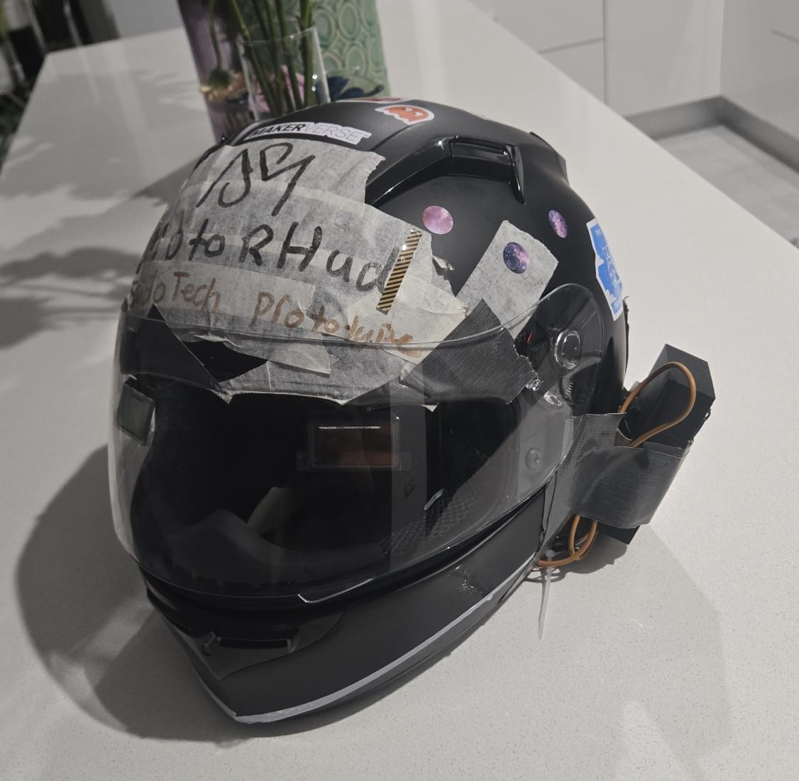

# 🏍️ MotorHUD

<p align="center">
  
  
</p>

MotorHUD shows the next turn and the current speed zone inside the helmet so your eyes stay on the road.  
This repo covers the helmet side. It includes the ESP32 hub firmware, a simple Android companion app starter, and printable case parts.  
The speed-sign vision stack lives in a separate repo named **SudoSpeed**. The display now uses transparent OLEDs for better integration and readability.

---

## Repo layout

```
Companion App/            Android starter for BLE and Directions
images/                   All images go here
Case.stl                  ESP32 and powerbank case
display_cover v1.stl      Display cover and helmet mount
Lid v1.stl                Lid for the cover
Esp32_code.cpp            ESP32 main firmware
SudoSpeed.py              Optional helper or bridge
README.md                 This file
LICENSE                   MIT license
```

---

## How it works

```
Phone Companion App → BLE text "NAV:<instruction>"
SudoSpeed on Pi or laptop → Classic BT SPP text "Z:<kph>"
ESP32 hub receives both → draws Navigation on left OLED and Zone on right OLED
Transparent OLEDs inside the visor present minimal, high-contrast text
```

Typical messages  
* From phone: `NAV:Turn left onto Hurley Street`  
* From SudoSpeed: `Z:60`

---

## Hardware overview

* Two 128×64 transparent OLEDs on shared SPI  
* ESP32 as the hub  
* Power from a small USB battery bank or bike 5 V regulator with fuse

**Pin diagram image**  
Upload your diagram as `images/pin_diagram.png` and it will appear here

<p align="center">
  
</p>

---

## Part A. ESP32 firmware

**File**  
`Esp32_code.cpp`

**Build steps**
1. Use Arduino IDE or PlatformIO  
2. Install ESP32 boards package  
3. Add libraries: Adafruit GFX, Adafruit SSD1306, BluetoothSerial, NimBLE-Arduino  
4. Flash to the board and open Serial Monitor

**First run**
* Screens show waiting text  
* Device advertises as `ESP32-SUDOSPEED` for Classic BT and a BLE UART name for the phone  
* Any line that starts with `NAV:` or `Z:` updates the display

---

## Part B. SudoSpeed link on Raspberry Pi

**Goal**  
Run SudoSpeed and forward zone updates to the ESP32.

**Steps**
1. Pair the Pi with the ESP32 over Classic Bluetooth SPP  
2. Run SudoSpeed with camera or a test clip  
3. Pipe lines that start with `Z:` to the SPP device

Relay example

```python
# relay_z_to_spp.py
import serial, sys
ser = serial.Serial("/dev/rfcomm0", 115200, timeout=1)
for line in sys.stdin:
    if line.startswith("Z:"):
        ser.write((line.strip() + "\n").encode("utf-8"))
```

Run

```bash
python3 run_speed_reader.py --source 0 --det detect.onnx --rec classify.onnx |
python3 relay_z_to_spp.py
```

You can also keep a small helper in `SudoSpeed.py` if you prefer a single entry point.

---

## Part C. Companion App

**Folder**  
`Companion App/`

**What it does**  
Gets GPS on the phone, calls the Google Directions API, reduces to the single next instruction, and sends `NAV:<text>` over BLE every few seconds. Re-routes if the rider turns away from the path.

**Setup**
1. Open in Android Studio  
2. Add your Directions API key  
3. Grant location and Bluetooth permissions  
4. Pair with the ESP32 and start

---

## Printing and assembly

**STLs**  
`Case.stl`, `display_cover v1.stl`, `Lid v1.stl`

**Notes**
1. Print in ABS or PETG for heat and weather  
2. Use small zip ties or M2 screws to secure the transparent OLED in the cover  
3. Route cables along the helmet edge and through the case grooves  
4. Test at night and in bright daylight before riding

---

## Images

Keep every photo in the images folder. Planned additions:

```
images/
  helmet_inside.png
  helmet_outside.png
  pi_case_final.png
  pin_diagram.png
```

Add more as needed and reference them directly from this folder.

---

## Safety

MotorHUD is a research and learning project. Test off-road first and always follow road rules.

---

## License

MIT. See `LICENSE` in this repo.
